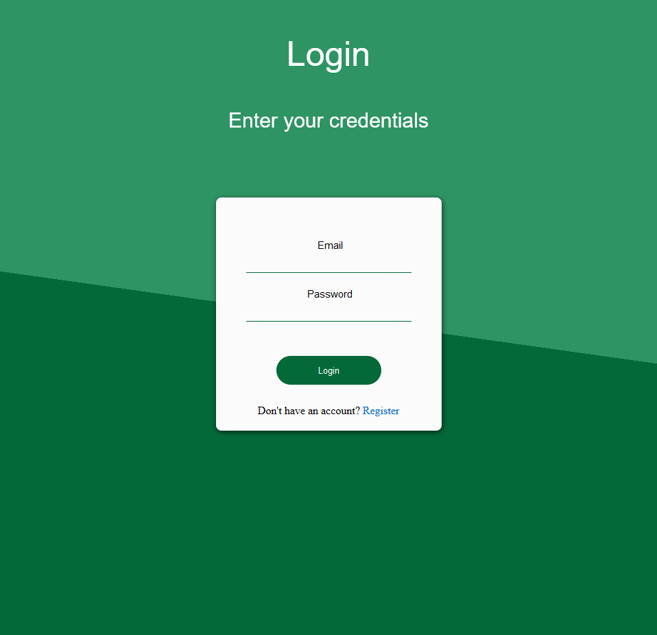
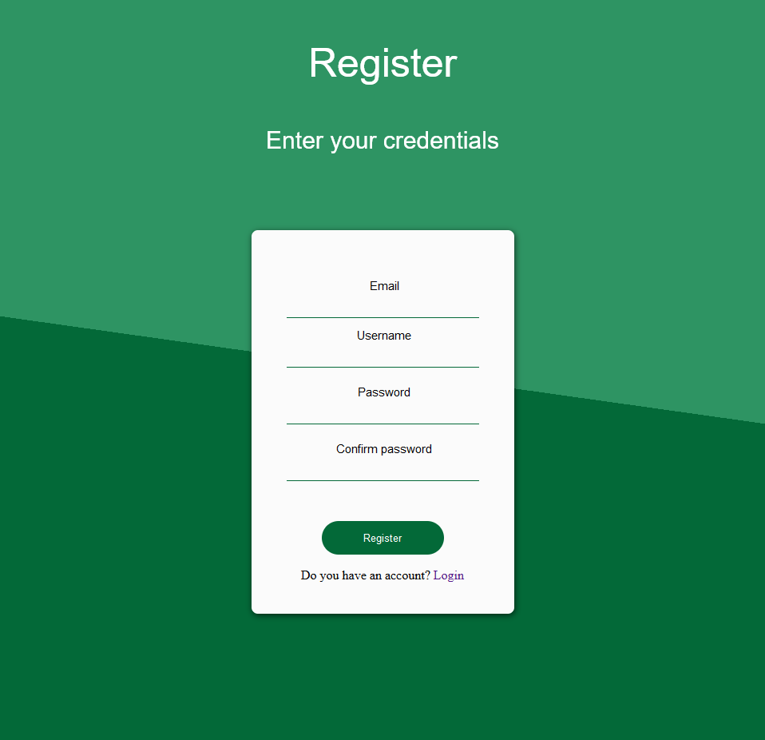
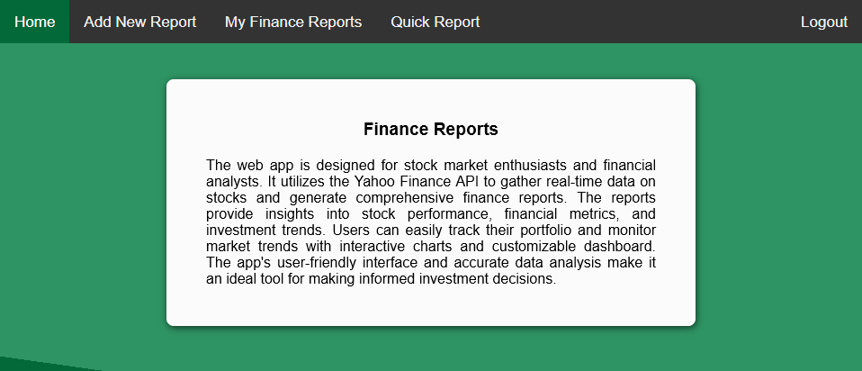
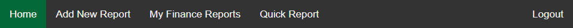
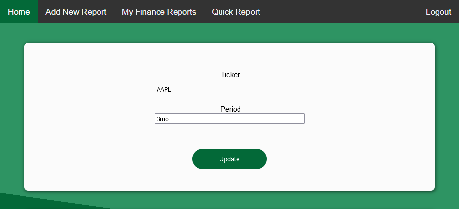
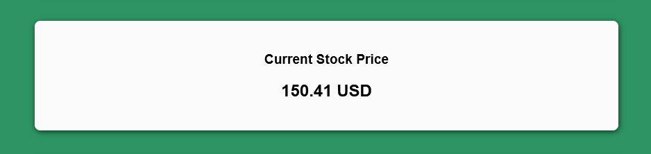
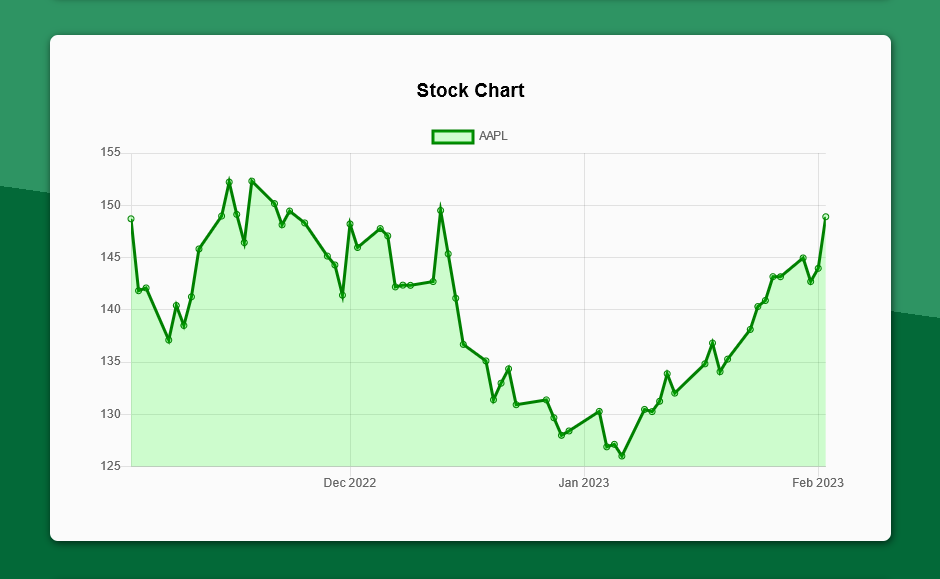
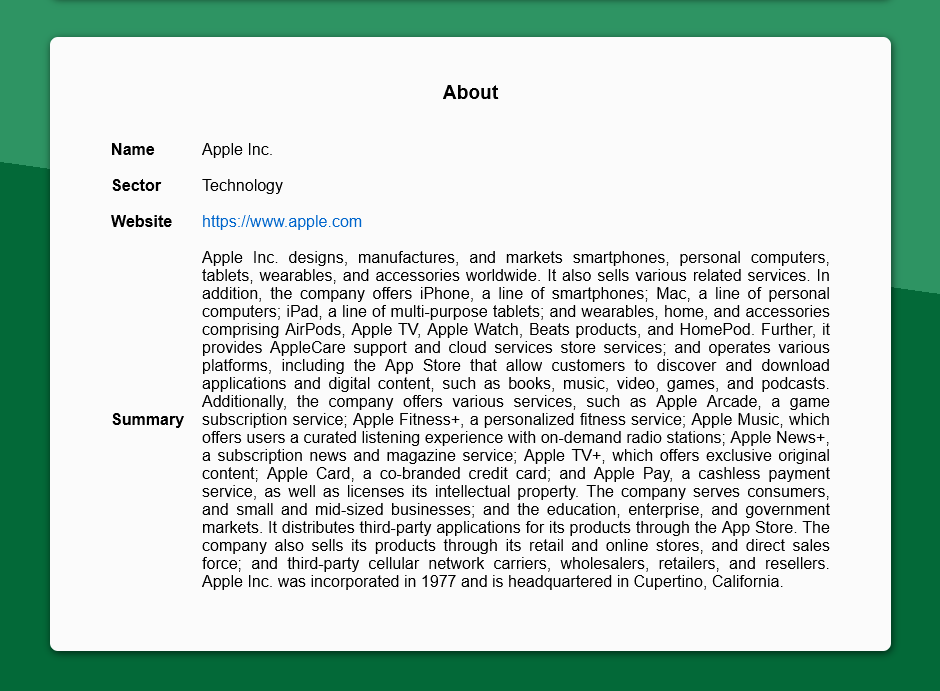
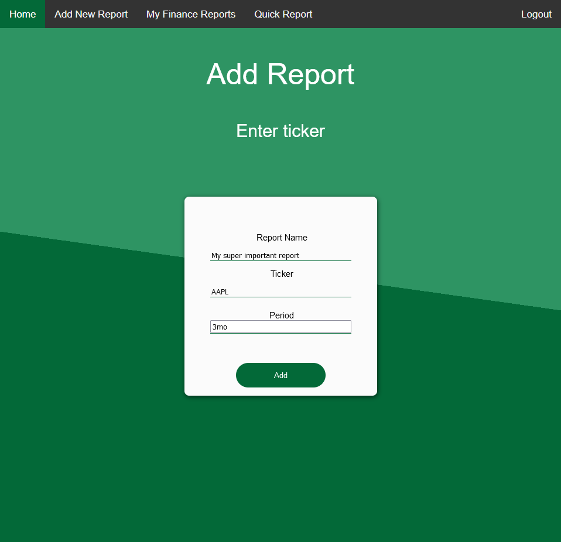
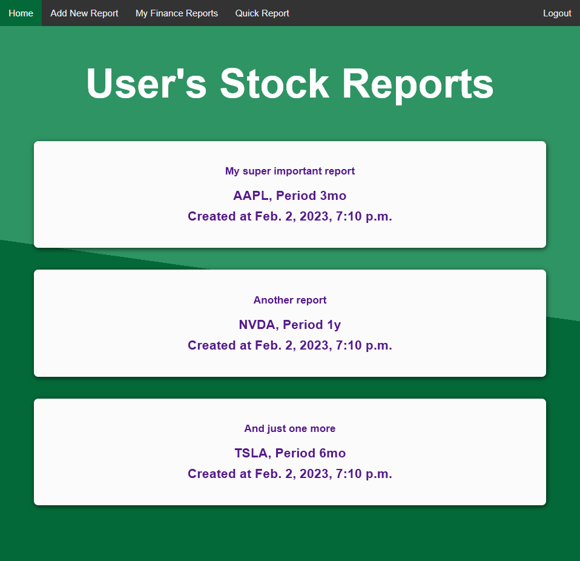

# Finance-Report

## About

Finance-Report ia a web app designed for stock market enthusiasts and financial analysts. It utilizes the Yahoo Finance API to gather real-time data on stocks and generate comprehensive finance reports. The reports provide insights into stock performance, financial metrics, and investment trends. Users can easily track their portfolio and monitor market trends with interactive charts and customizable dashboard. The app's user-friendly interface and accurate data analysis make it an ideal tool for making informed investment decisions.

## How to use the app?

The app is hosted on Microsoft Azure and to use it is as simple as going to [this link](https://finance-reports.azurewebsites.net/).

By default you're going to be redirected to the login page as it is not possible to use the app without an account.

From the login page you can easily navigate to the register page if you don't have an account yet.

Once logged in, you'll be presented with the Home page containing some basic information about the app.

From here you can go to other parts of the app using the ribbon on the top of the page.

The easiest way to get started is the Quick Report option. It allows you to quickly generate a report for a specific stock and a specific period of time. Just use the form at the top of the page. The available time periods are `1d`, `5d`, `1mo`, `3mo`, `6mo`, `1y`, `2y`, `5y`, `10y`, `ytd` and `max`.

The page is going to refresh and you're going to see the current price of the selected stock as well as a chart representing how the prices were changing throughout the specified period of time and a quick summary with basic information about the company that the stock belongs to.

Next, you can check out the "Add New Report" page. Here, as the name suggests, you can add a new report to the list of your reports. You can give your report a name and specify the ticker and a period of time for the report.

All of your reports can be seen on the "My Finance Reports" page. You can click on any of the reports to view it.

## How to set up a development environment?

This app is licensed under an open source license (MIT) so everyone is welcome to modify it or extend its functionality. To set up a development environment you need to:
1. Download and install [Python 3](https://www.python.org/downloads/) programming language (recommended version: 3.10.4 or above)
2. Clone this repository to a local directory
3. Create a Python virtual environment and activate it using the commands below (optional)
- Windows (cmd.exe)
`python -m venv {name_of_choice}`
`.\{name_of_choice}\Scripts\activate.bat`
- Linux or other unix-based operating systems
`python3 -m venv {name_of_choice}`
`source ./{name_of_choice}/Scripts/activate`
4. Install all the required packages using the command below invoked from the repository directory
- Windows (cmd.exe)
`pip install -r requirements.txt`
- Linux or other unix-based operating systems
`pip3 install -r requirements.txt`
5. Run Django's migrate command
- Windows (cmd.exe)
`python manage.py migrate`
- Linux or other unix-based operating systems
`python3 manage.py migrate`
6. Run a local webserver
- Windows (cmd.exe)
`python manage.py runserver`
- Linux or other unix-based operating systems
`python3 manage.py runserver`
7. Access the application using a web browser at http://127.0.0.1:8000/ by default

## Azure Deployment for Polsl students 

